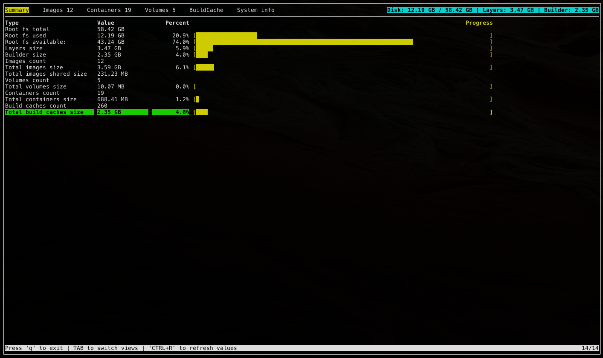
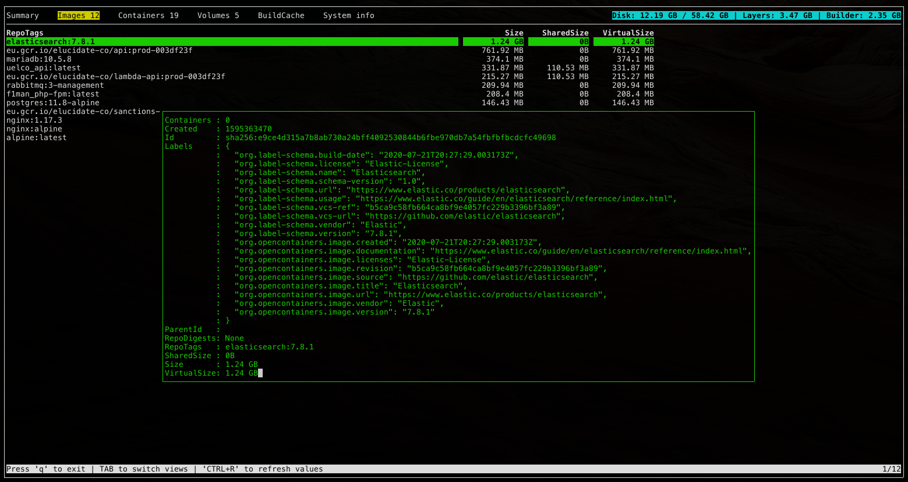
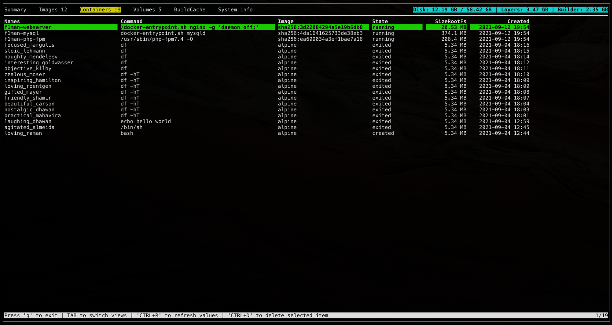
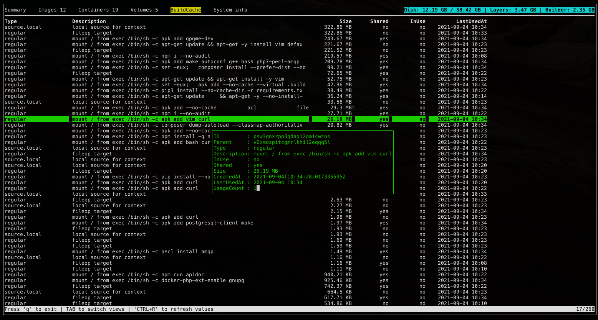
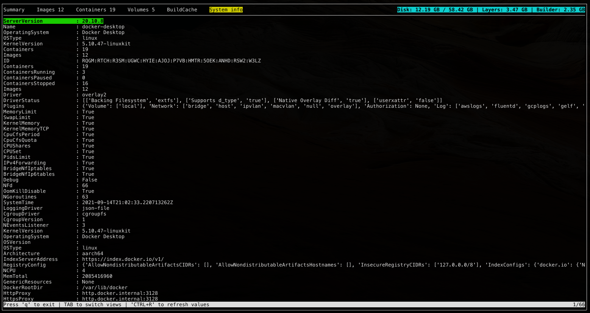

# Docker Disk space usage

This is a TUI tool to manage and see how docker uses disk space.

Why: on Mac running out of disk space happens quite often.
This utility can be used to see what can be deleted and pruned.

## Install & run

`pip install -r requirements.txt`
`python dockui.py`

## Screenshots

 +2
 +2
++
++
++
++
++
++
++
